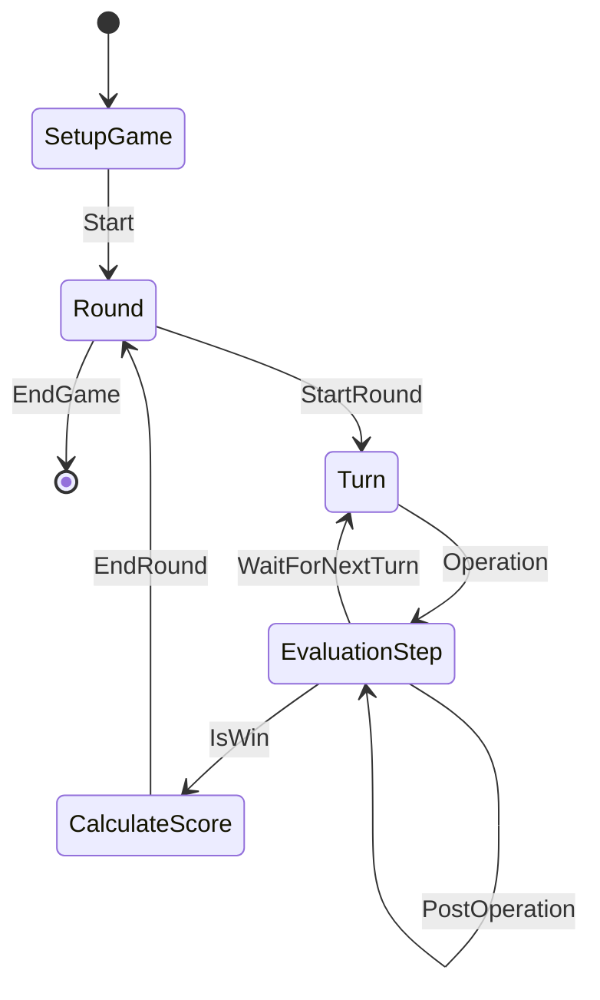

# card_engine_pp

This is the card_engine_pp project.

# Building and installing

See the [BUILDING](BUILDING.md) document.

# Contributing

See the [CONTRIBUTING](CONTRIBUTING.md) document.

# Licensing

<!--
Please go to https://choosealicense.com/licenses/ and choose a license that
fits your needs. The recommended license for a project of this type is the
Boost Software License 1.0.
-->

# Design Ideas

Notice that Turn to CheckState have the same flow. It seems that we might be able to define a card game by utilising Turn -> CheckState for all transitions. The transition should specify what player can take the action, who the next action taker is, what the board state requires for this action to be valid.

